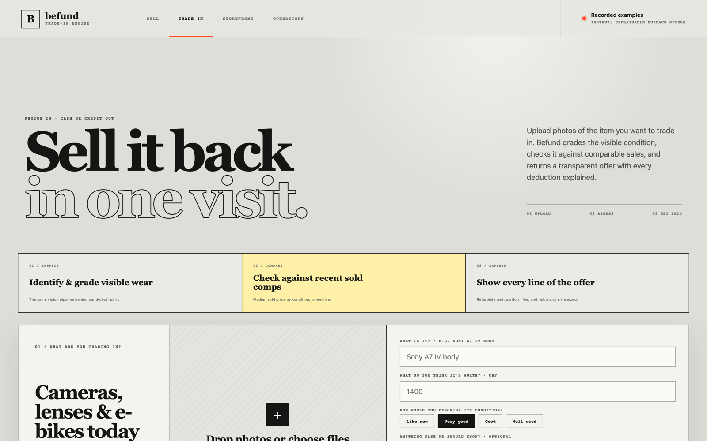
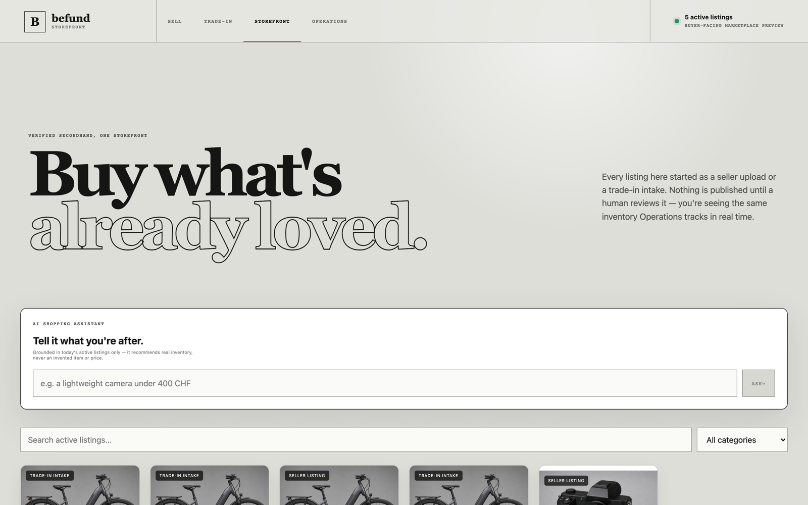
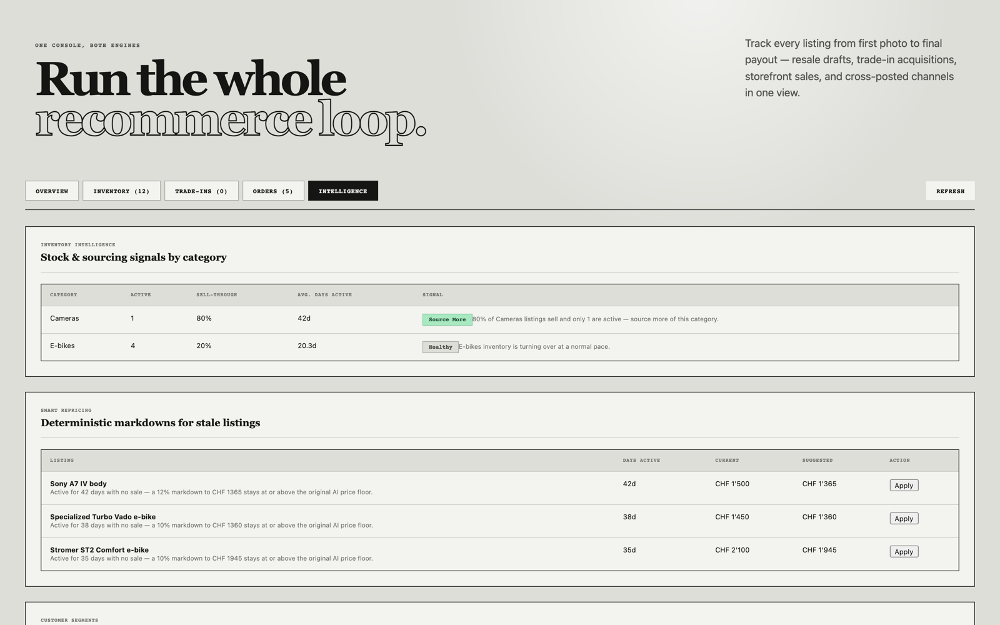
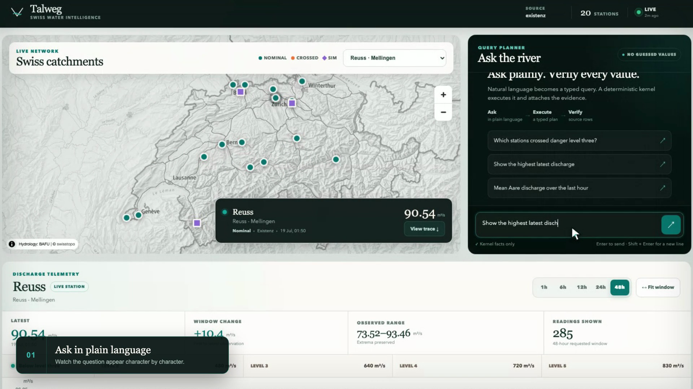

# Hi, I'm Vitalii Znak

  

  
  
  
  
  
  

  

- 🌱 Currently learning: AI agent workflows — multi-step, tool-using agents and how to keep them grounded and auditable.

## Featured work

### [Befund](https://github.com/vitaliiznak/befund) — recommerce management platform

A photo-in listing engine powering two seller journeys (resale + AI-assessed
trade-in buybacks), a buyer-facing storefront, and an operations console with
deterministic inventory, repricing, and fraud-risk intelligence. Every AI
suggestion stays editable and requires human review before anything publishes
or pays out.

<table>
  <tr>
    <td></td>
    <td></td>
    <td></td>
  </tr>
</table>

### [Talweg](https://github.com/vitaliiznak/talweg) — Swiss water intelligence

Ask a river a plain-language question and get a deterministic, auditable
answer: live FOEN/BAFU discharge data, a guarded language-model interface, and
a receipt that shows exactly which measurement the answer came from. The
model may interpret the question — it never gets to invent the number.

<table>
  <tr>
    <td></td>
  </tr>
</table>

